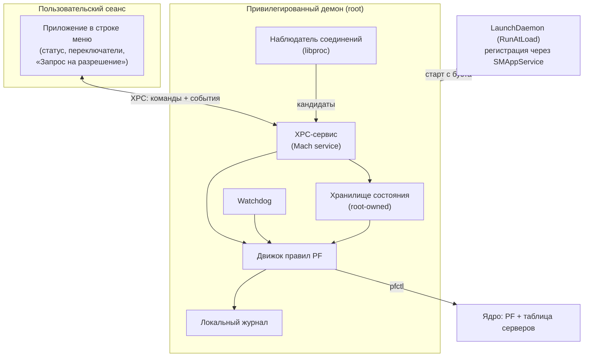
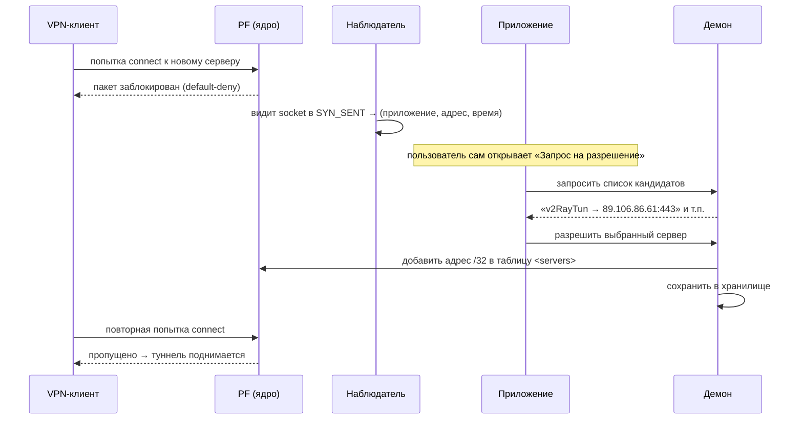
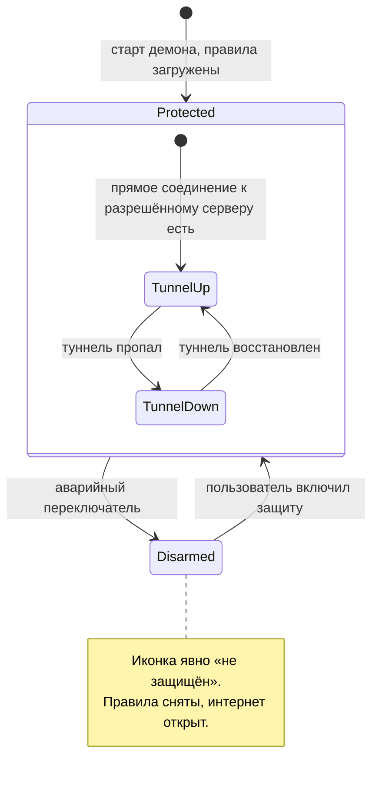

# feat: VPN Kill Switch для macOS

## Summary

Личное приложение в строке меню + привилегированный фоновый демон, который держит фаервол macOS (PF) постоянно в режиме «по умолчанию блокировать весь интернет», пробивая лишь явный белый список адресов VPN-серверов. Демон владеет защитой и переживает закрытие/падение интерфейса; приложение — тонкий пульт поверх него. Разрешения выдаются вручную из пункта «Запрос на разрешение» по модели «разрешён адрес сервера, остальное закрыто».

---

## Problem Frame

Реальный IP утекает не во время стабильной работы VPN, а в переходные моменты: старт компьютера до подъёма туннеля, обрыв/зависание туннеля, переключение серверов или клиентов, сон/пробуждение, смена сети. Сторонние VPN-клиенты — чёрные ящики, их собственные kill switch'и не контролируются. Нужен независимый страховочный слой ниже всех клиентов, управляемый простым интерфейсом, а не командами в терминале (полное обоснование — см. origin: `docs/brainstorms/2026-06-07-vpn-kill-switch-macos-requirements.md`).

Ключ к надёжности — защита как **состояние покоя**: фаервол всегда блокирует всё, кроме узких разрешений, поэтому падение туннеля ничего не меняет и утечь не успевает.

---

## High-Level Technical Design

Архитектура направляющая, не предписывающая до буквы реализации.

### Топология компонентов



### Поток выдачи разрешения новому серверу



### Состояния защиты и иконки (R14 — без «тихих» состояний)



### Структура managed-ruleset PF (направляющий эскиз, не финальный синтаксис)

```pf
set block-policy drop
set skip on lo0

# 1. База: запретить всё в обе стороны (R1)
block in  all
block out all

# 2. IPv6 закрыт полностью, без исключений (R4)
block quick inet6 all

# 3. Трафик внутри ЛЮБОГО туннеля доверяем — группа интерфейсов utun (R7, R11)
pass quick on utun all

# 4. Разрешённые серверы — динамическая таблица /32 (R8, R10)
table <servers> persist
pass out quick inet proto { tcp udp } from any to <servers>

# 5. Локальная сеть — таблица включается тумблером (R15)
table <lan> const { 10/8, 172.16/12, 192.168/16, 169.254/16 }
# pass quick inet from any to <lan>   # активируется по настройке

# 6. Сохранить системные якоря Apple — AirDrop, общий доступ (R19)
anchor "com.apple/*"
```

DNS (R5) не требует отдельного правила: широкого «DNS на любой адрес» нет, значит DNS наружу заблокирован по умолчанию, а DNS внутрь туннеля проходит через `pass on utun`.

---

## Output Structure

Гринфилд: новый проект. Ожидаемая раскладка (per-unit `Files` — источник истины; дерево даёт общую форму).

```
KillSwitch.xcodeproj
App/                              # таргет приложения (строка меню)
  KillSwitchApp.swift
  MenuBarController.swift
  PermissionRequestsView.swift    # «Запрос на разрешение»
  ServersListView.swift
  StatusIcon.swift
  DaemonRegistration.swift        # SMAppService
  XPCClient.swift
  Assets.xcassets                 # иконки состояний
Daemon/                           # таргет привилегированного демона
  main.swift
  PFRulesetManager.swift
  Watchdog.swift
  ConnectionObserver.swift        # libproc
  StateStore.swift
  XPCService.swift
  EventLog.swift
  killswitch.pf.template          # шаблон ruleset
  com.killswitch.daemon.plist     # LaunchDaemon
Shared/                           # общий модуль
  IPCProtocol.swift               # XPC-протокол
  Models.swift                    # ServerRule, Candidate, ProtectionState
Tests/
  DaemonTests/
  AppTests/
```

---

## Requirements

Перенесены из origin-документа (ID сохранены). R22–R23 уточняют поток разрешения по итогам планирования.

### Ядро защиты (fail-closed)

- R1. Базовое состояние — блокировать весь исходящий и входящий интернет-трафик, кроме явного белого списка. Обрыв VPN ничего не меняет в фаерволе.
- R2. Защита действует с первой секунды загрузки — best-effort, до входа в систему и подъёма VPN (см. остаточный boot-gap в Рисках).
- R3. Watchdog восстанавливает правила, если их сбросили; в промежутке трафик заблокирован.
- R4. Весь IPv6 заблокирован полностью, без приоткрывающих исключений.
- R5. DNS разрешён только внутрь туннеля/локально; «DNS на любой адрес» отсутствует.
- R6. Защита сохраняется при смене сети и сне/пробуждении — правила привязаны к адресам, не к адаптерам.

### Распознавание сервера и разрешения

- R7. Демон определяет прямые исходящие попытки соединения на физическом интерфейсе (транспорт VPN), сопоставляя их с процессом.
- R8. Каждый новый, ранее не разрешённый сервер заблокирован и требует подтверждения одним действием; разрешённые запоминаются.
- R9. Поддерживается несколько VPN-приложений и переключение между ними без ручной переконфигурации.
- R10. Разрешение сервера привязано к адресу узко (/32), не к адаптеру.
- R11. Имя туннельного интерфейса не зашивается: доверяется группа интерфейсов `utun` целиком.
- R12. Ручной ввод адреса сервера остаётся как запасной/продвинутый способ.
- R22. Разрешения выдаются из пункта «Запрос на разрешение» без всплывающих окон. Список кандидатов = (5 последних приложений с прямыми исходящими попытками) ∪ (все попытки за последние 5 минут), минус уже разрешённые серверы. (уточняет R8)
- R23. Каждый кандидат показан как `приложение → адрес:порт`; разрешение добавляет в белый список **адрес назначения /32**, а не приложение. (уточняет R7, R8)

### Управление и видимость

- R13. Аварийный переключатель «Выключить защиту» доступен всегда в окне приложения, срабатывает мгновенно и без интернета; сопровождается явным предупреждением.
- R14. Иконка в строке меню отражает состояние (защищён / туннель не активен / не защищён); «тихих» состояний нет.
- R15. Доступ к локальной сети — переключаемое разрешение.
- R16. Настройки и список разрешённых серверов сохраняются между перезапусками.
- R17. Управление — через приложение в строке меню, без терминала.
- R24. Иконка показывает, когда есть новый кандидат на разрешение (чтобы не гадать, почему пропал интернет); состояния «туннель не активен (безопасно)» и «не защищён» визуально различимы не только цветом.

### Архитектура (личный MVP, путь к раздаче открыт)

- R18. Защиту держит привилегированный демон, а не интерфейс; закрытие/падение приложения не снимает блокировку.
- R19. Наши правила не затирают системные якоря Apple.
- R20. Серверы и клиенты конфигурируемые, не зашиты в код.
- R21. Никаких данных наружу: только локальные логи событий.

---

## Key Technical Decisions

- KTD1. **Фундамент — управляемый ruleset PF, загружаемый root-демоном.** Демон при старте загружает свой главный ruleset (`pfctl -E -f`), устанавливающий default-deny, и включает `anchor "com.apple/*"`, чтобы не потерять системные правила Apple. Не редактируем защищённый SIP `/etc/pf.conf`. (R1, R19) — см. Sources.
- KTD2. **Разделение на два процесса.** Привилегированный демон (root) владеет фаерволом и всем состоянием; приложение в строке меню — тонкий XPC-клиент. Защита переживает закрытие/краш приложения. (R18)
- KTD3. **Default-deny как состояние покоя.** Белый список: `lo0` (через `set skip`), вся группа `utun`, динамическая таблица `<servers>`, опционально таблица `<lan>`. IPv6 закрыт полностью; широкого DNS-разрешения нет. Известные осознанные границы (личный MVP, не дорабатываем сейчас): доверяется *любой* туннель `utun`, включая чужие VPN/iCloud Private Relay; включённый тумблер LAN открывает и IP шлюза (то есть локальный DNS) — мелкая уступка ради удобства домашней сети. (R1, R4, R5, R10, R11)
- KTD4. **Разрешаем адрес, а не приложение.** PF фильтрует по адресу/порту/интерфейсу, не по процессу. Поэтому «разрешить» в списке = добавить адрес сервера /32 в таблицу `<servers>`; имя приложения берётся через libproc только для подписи строки `приложение → адрес`. Фильтрация «по приложению» (Little Snitch / NetworkExtension) сознательно отложена. Следствие (осознанно принимаем): правило разрешения `from any`, поэтому к разрешённому адресу сервера теоретически может сходить и другая программа — это один узкий адрес, не открытый интернет. (R8, R22, R23)
- KTD5. **Распознавание через libproc.** Наблюдатель перечисляет сокеты процессов (`proc_pidinfo`/`proc_pidfdinfo`), включая заблокированные/ожидающие (SYN_SENT), сопоставляет socket → процесс → адрес назначения. Это работает даже когда соединение заблокировано default-deny — именно так новый сервер становится виден. (R7, R23) — см. Sources.
- KTD6. **Блокировка с буста + установка через SMAppService.** LaunchDaemon с `RunAtLoad`/`KeepAlive` поднимает демон рано в загрузке; регистрация — `SMAppService.daemon(plistName:)` (macOS 13+, одно подтверждение в Системных настройках). Ручная установка — запасной путь для MVP. Остаточный boot-gap (ядро подняло сеть ↔ демон стартовал) признан и вынесен в Риски. (R2)
- KTD7. **Аварийное выключение — всегда доступно, нельзя запереть пользователя.** Основной путь: переключатель в приложении снимает/выключает наш ruleset по локальному Mach-каналу, поэтому работает при полной блокировке и без интернета. Гарантированный запасной путь без терминала: Системные настройки → «Объекты входа и расширения» → выключить наш фоновый компонент (он же перестаёт стартовать с буста). После аварийного выключения и перезагрузки демон **возвращается во включённое (защищённое) состояние** — он никогда не загружается молча открытым. Выключение использует штатный путь PF так, чтобы фаервол можно было выключить начисто (без накопления ссылок `pfctl -E`). (R13)
- KTD8. **Watchdog — сверка, по возможности по событию.** Демон проверяет, что PF включён и наш ruleset загружен; при сбросе — немедленная переустановка. Важная оговорка: «в промежутке заблокировано» верно для случая *сброса правил*; если кто-то *выключил сам PF*, то до следующей проверки трафик открыт. Поэтому сверка предпочтительно срабатывает по событию (а не только по таймеру), чтобы окно было минимальным. (R3, R6)
- KTD9. **Состояние в root-owned хранилище, загружается до включения правил.** Список серверов и настройки читаются на старте раньше, чем демон разрешает трафик. Журнал только локальный, само приложение в сеть не ходит. (R16, R21)
- KTD10. **Серверы — /32 адреса, не привязанные к адаптеру.** Таблица `<servers>` обновляется на лету (`pfctl -t servers -T add/delete`) без полной перезагрузки правил; запись переживает смену Wi-Fi/Ethernet и сон. (R6, R10)

---

## Implementation Units

Поэтапно: **Этап A (U1–U4)** — костяк всегда-включённой защиты; **Этап B (U5)** — устойчивость; **Этап C (U6–U7)** — распознавание и связь; **Этап D (U8–U9)** — интерфейс и журнал. Так защита становится рабочей раньше слоя удобства. Чтобы каждый этап был пригоден к использованию, минимальный путь «разрешить сервер вручную по адресу» (R12) подтягивается уже в Этап A/B (тонкий срез U7+U8 поверх таблицы серверов), не дожидаясь автоопределения (U6).

### U1. Каркас проекта и раскладка бандла

- **Goal:** Создать два таргета (приложение + демон-helper) и общий модуль типов; раскладку бандла под SMAppService.
- **Requirements:** R18, R20
- **Dependencies:** —
- **Files:** `KillSwitch.xcodeproj`, `App/KillSwitchApp.swift`, `Daemon/main.swift`, `Shared/IPCProtocol.swift`, `Shared/Models.swift`
- **Approach:** Демон-исполняемый лежит внутри бандла приложения (требование SMAppService). `Shared` определяет типы `ServerRule`, `Candidate`, `ProtectionState` и XPC-протокол. Конфигурируемый список клиентов/серверов хранится как данные, не в коде (R20).
- **Patterns to follow:** Локальных нет (гринфилд). Ориентир — `alienator88/HelperToolApp` (SMAppService-каркас, см. Sources).
- **Test scenarios:** `Test expectation: none — каркас/скаффолдинг; поведенческих изменений нет.` Проверка — сборка обоих таргетов.
- **Verification:** Оба таргета собираются; общий модуль линкуется в оба.

### U2. Хранилище состояния и настроек (демон)

- **Goal:** Надёжно хранить и загружать список разрешённых серверов и настройки в root-owned файле.
- **Requirements:** R16, R20, R21
- **Dependencies:** U1
- **Files:** `Daemon/StateStore.swift`, `Tests/DaemonTests/StateStoreTests.swift`
- **Approach:** Атомарная запись (temp + rename) в каталог, доступный только root (например, под `/Library/Application Support/`). Модель: `[ServerRule]` (адрес /32, метка, дата), `protectionEnabled`, `lanAllowed`, список клиентов. Загрузка обязана отрабатывать раньше включения правил (используется U4).
- **Patterns to follow:** —
- **Test scenarios:**
  - Сохранение и чтение возвращают идентичный набор серверов и настроек (happy path).
  - Пустое/отсутствующее хранилище → корректные значения по умолчанию (protection on, lan off, серверов нет) (edge).
  - Битый/частично записанный файл → загрузка не падает, откат к дефолтам с записью в журнал (error).
  - Конкурентная запись (две команды подряд) не оставляет файл в полуразрушенном виде (edge).
- **Verification:** Перезапуск демона восстанавливает ровно тот список серверов и настройки, что были до него.

### U3. Движок правил PF

- **Goal:** Генерировать, валидировать и применять managed-ruleset из текущего состояния и обновлять таблицу серверов на лету.
- **Requirements:** R1, R4, R5, R10, R11, R15, R19
- **Dependencies:** U2
- **Files:** `Daemon/PFRulesetManager.swift`, `Daemon/killswitch.pf.template`, `Tests/DaemonTests/PFRulesetManagerTests.swift`
- **Approach:** Сборка ruleset по эскизу из HTD: default-deny, `set skip on lo0`, `block quick inet6 all`, `pass quick on utun all`, таблица `<servers>`, опциональная `<lan>`, `anchor "com.apple/*"`. Перед применением — синтаксическая проверка (`pfctl -vnf`), затем загрузка. Добавление/удаление сервера — через операции с таблицей (`pfctl -t servers -T add/delete`), без полной перезагрузки. Точный способ сохранения системных якорей Apple проверяется на этапе исполнения (см. Open Questions).
- **Patterns to follow:** Подход «свой anchor/managed ruleset + LaunchDaemon» (см. Sources).
- **Test scenarios:**
  - Из состояния с N серверами генерируется ruleset, проходящий `pfctl -vnf` без ошибок (happy path).
  - Сгенерированный ruleset содержит `block` по умолчанию и полный блок `inet6` (Covers AE6).
  - `pass on utun all` присутствует независимо от того, какие `utun` активны (Covers AE7 — прямой трафic мимо разрешённого блокируется).
  - Добавление сервера кладёт ровно его /32 в таблицу; повторное добавление идемпотентно (edge).
  - Удаление сервера убирает /32; трафик к нему снова блокируется (happy path).
  - Тумблер LAN включает/выключает правило `<lan>`, не трогая остальное (edge).
  - Невалидный шаблон/адрес → применение отклоняется, прежние правила остаются в силе (error; отсутствие утечки приоритетнее).
- **Verification:** На реальном сетапе: до разрешения сервера соединение к нему заблокировано; после — проходит; всё прочее наружу закрыто.

### U4. Демон и блокировка с буста

- **Goal:** Поднимать демон с загрузки системы, включать PF и загружать правила из сохранённого состояния; устанавливаться через SMAppService.
- **Requirements:** R1, R2, R18
- **Dependencies:** U2, U3
- **Files:** `Daemon/main.swift`, `Daemon/com.killswitch.daemon.plist`, `App/DaemonRegistration.swift`
- **Approach:** LaunchDaemon plist с `RunAtLoad=true`, `KeepAlive=true`. На старте: загрузить состояние (U2) → собрать ruleset (U3) → включить PF и применить. Регистрация из приложения через `SMAppService.daemon(plistName:)` с обработкой статусов (требуется одобрение в Системных настройках). Запасной путь — ручная установка plist (для личного MVP).
- **Patterns to follow:** `SMAppService.daemon` + `try service.register()` (см. Sources).
- **Test scenarios:**
  - На старте демона с непустым состоянием PF включается и правила применяются до разрешения любого нового трафика (Covers AE1 — старт до VPN).
  - Если состояние пустое, default-deny всё равно активен (наружу ничего) (edge).
  - `register()` в непривилегированном/неодобренном состоянии возвращает понятную ошибку и проброс статуса в UI (error).
  - `KeepAlive` перезапускает убитый демон, и он восстанавливает правила (Covers AE5 — но через рестарт; основной путь — watchdog U5).
- **Verification:** После перезагрузки Mac до входа в систему весь внешний трафик заблокирован; после подъёма VPN к разрешённому серверу интернет работает.

### U5. Watchdog

- **Goal:** Гарантировать, что правила и PF не остаются сброшенными.
- **Requirements:** R3, R6
- **Dependencies:** U3, U4
- **Files:** `Daemon/Watchdog.swift`, `Tests/DaemonTests/WatchdogTests.swift`
- **Approach:** Сверка предпочтительно по событиям (пробуждение, смена сети) плюс таймер как страховка: включён ли PF и загружен ли наш ruleset/таблица. При расхождении — немедленная переустановка (U3). Особый случай: если *выключен сам PF*, до восстановления трафик открыт — поэтому окно проверки держим маленьким. Интервал тюнится на этапе исполнения (см. Open Questions).
- **Patterns to follow:** —
- **Test scenarios:**
  - Внешний сброс правил → следующая сверка переустанавливает их (Covers AE5).
  - PF выключили извне → watchdog включает обратно и грузит ruleset (error).
  - Пробуждение из сна / смена адаптера → правила остаются актуальны без ручных действий (Covers AE2-смежно; R6).
  - Когда всё в порядке, лишних перезагрузок правил не происходит (edge — отсутствие дребезга).
- **Verification:** Ручной `pfctl -F`/`pfctl -d` из терминала автоматически откатывается; проверять прямым наблюдением (а не только по pflog — при выключенном PF он не пишет).

### U6. Наблюдатель соединений (libproc) и список кандидатов

- **Goal:** Видеть прямые исходящие попытки соединения (включая заблокированные) и формировать список кандидатов на разрешение.
- **Requirements:** R7, R9, R22, R23
- **Dependencies:** U1, U2, U3 (нужна таблица `<servers>`, чтобы прятать уже разрешённые адреса из кандидатов)
- **Files:** `Daemon/ConnectionObserver.swift`, `Tests/DaemonTests/ConnectionObserverTests.swift`
- **Approach:** Через `proc_pidinfo(PROC_PIDLISTFDS)` + `proc_pidfdinfo(PROC_PIDFDSOCKETINFO)` перечислять TCP/UDP-сокеты процессов; отбирать прямые исходящие к публичным адресам (не приватные, не внутритуннельные). **Дискриминатор «прямое vs внутритуннельное» — это ядро U6, поэтому решается здесь, а не откладывается:** основной метод — удалённый адрес публичный И не входит в туннельные диапазоны, плюс локальный адрес сокета принадлежит физическому интерфейсу. Для TCP берём в т.ч. SYN_SENT; для **UDP/QUIC** (WireGuard и прочие — у них нет SYN_SENT) кандидат строится по адресу назначения + давности. Вести rolling buffer записей `(процесс, адрес:порт, время)`. Кандидаты = (5 последних процессов с попытками) ∪ (все попытки за 5 минут), минус адреса из таблицы `<servers>`. Заблокированную попытку по **IPv6** показываем как диагностический кандидат «нельзя разрешить — IPv6 закрыт», чтобы IPv6-сервер не выглядел просто мёртвым. Демон работает как root, поэтому видит сокеты всех процессов.
- **Patterns to follow:** Техника libproc как в исходниках `lsof` (см. Sources).
- **Test scenarios:**
  - Сокет в SYN_SENT к публичному адресу попадает в кандидаты с верным именем процесса и адресом (Covers AE3 — новый сервер).
  - Адрес, уже присутствующий в `<servers>`, из кандидатов исключён (Covers AE4 — знакомый сервер).
  - Список ограничен по правилу «5 последних ∪ 5 минут»; устаревшие записи выпадают (edge).
  - Внутритуннельные/приватные адреса в кандидаты не попадают (edge — отсев шума).
  - Несколько прямых адресов у одного процесса дают несколько строк-кандидатов (edge).
  - Прямой UDP/QUIC-сокет к публичному адресу попадает в кандидаты по адресу+давности, без опоры на SYN_SENT (edge — connectionless-транспорт).
  - Заблокированная попытка по IPv6 показывается как диагностический кандидат «нельзя разрешить — IPv6 закрыт» (edge — известное ограничение).
- **Verification:** На реальном сетапе при попытке VPN-клиента подключиться к новому серверу строка `клиент → адрес` появляется в кандидатах; после разрешения исчезает.

### U7. IPC-слой (XPC)

- **Goal:** Дать приложению управлять демоном и получать состояние/события по локальному каналу.
- **Requirements:** R13, R14, R15, R17
- **Dependencies:** U2, U3, U6
- **Files:** `Daemon/XPCService.swift`, `App/XPCClient.swift`, `Shared/IPCProtocol.swift`
- **Approach:** Mach-сервис демона. Команды: получить состояние, включить/выключить защиту, разрешить сервер (адрес), удалить сервер, переключить LAN, аварийный disarm. События: новый кандидат / смена состояния. Аварийный disarm обрабатывается синхронно и приоритетно, и должен переживать перезапуск/переподключение приложения — нельзя оставить пользователя без способа выключить защиту (см. KTD7). Проверку подписи вызывающего клиента в личном MVP не делаем (осознанно — приоритет удобства).
- **Patterns to follow:** —
- **Test scenarios:**
  - «Разрешить сервер» доходит до движка правил и адрес появляется в `<servers>` (integration; Covers AE3).
  - «Аварийный disarm» снимает защиту немедленно и без сетевого доступа (Covers AE8).
  - «Включить защиту» возвращает состояние в default-deny + сохранённые серверы (happy path).
  - Запрос состояния отражает реальное (PF включён? туннель активен? серверов сколько?) для иконки (integration с R14).
  - Аварийный disarm срабатывает, даже если приложение только что перезапустилось/переподключилось (надёжность пути выключения).
- **Verification:** Все действия пульта проходят к демону и обратно; аварийный disarm срабатывает при полностью заблокированной сети.

### U8. Приложение в строке меню

- **Goal:** Дать понятный пульт: статус, переключатели, выдачу разрешений, список серверов.
- **Requirements:** R12, R13, R14, R15, R17, R22, R23
- **Dependencies:** U7
- **Files:** `App/MenuBarController.swift`, `App/StatusIcon.swift`, `App/PermissionRequestsView.swift`, `App/ServersListView.swift`, `App/Assets.xcassets`, `Tests/AppTests/CandidateListTests.swift`
- **Approach:** Иконка отражает состояние без «тихих» состояний (R14): «защищён», «туннель не активен (безопасно)» и «не защищён» различимы формой, не только цветом; плюс значок-подсказка, когда есть новый кандидат на разрешение (R24) — чтобы не гадать, почему нет интернета. Поповер: переключатель защиты и аварийный switch; при выключенной защите — постоянная явная надпись «Защита выключена — реальный IP открыт» (без модального диалога, чтобы выключалось мгновенно, R13). Пункт «Запрос на разрешение»: список кандидатов `приложение → адрес:порт`, разрешение одним нажатием (R22, R23); пустой список показывает поясняющую строку, а не пустой экран; после «разрешить» строка сразу исчезает и статус обновляется. Список разрешённых серверов с удалением; ручной ввод адреса как запасной способ (R12). Тумблер LAN (R15). Первый запуск: пока демон не одобрен в Системных настройках (или одобрение отклонено) — иконка «не защищён», в поповере одна понятная подсказка «Требуется разрешение → Системные настройки», остальные элементы неактивны. Если связь с демоном потеряна — отдельное состояние «нет связи с демоном», а не устаревшая иконка.
- **Patterns to follow:** SwiftUI `MenuBarExtra` (либо AppKit `NSStatusItem`).
- **Test scenarios:**
  - Маппинг состояния от демона → корректная иконка для всех состояний; «туннель не активен (безопасно)» и «не защищён» различимы не только цветом (Covers AE8; R14, R24).
  - Пустой список кандидатов показывает поясняющую строку, а не пустой экран (edge).
  - Нажатие «разрешить» шлёт верный адрес в демон, строка сразу исчезает, статус обновляется (integration; Covers AE3).
  - Список кандидатов рендерит `приложение → адрес` и скрывает уже разрешённые (Covers AE3, AE4).
  - При появлении нового кандидата иконка показывает подсказку «есть запрос» (R24).
  - Первый запуск до одобрения демона: иконка «не защищён» + подсказка вести в Системные настройки; при потере связи с демоном — состояние «нет связи», не устаревшая иконка (edge).
  - Аварийный switch показывает явную надпись «не защищён» и снимает защиту (Covers AE8).
  - Ручной ввод невалидного адреса отклоняется с понятной ошибкой рядом с полем (error).
- **Verification:** Сценарии AE3, AE4, AE8 проходят целиком через интерфейс без терминала.

### U9. Локальный журнал событий

- **Goal:** Вести локальный журнал ключевых событий для диагностики, без отправки наружу.
- **Requirements:** R21
- **Dependencies:** U3, U4
- **Files:** `Daemon/EventLog.swift`
- **Approach:** Запись событий: включение/выключение защиты, добавление/удаление сервера, перезагрузка правил watchdog'ом, сработавшая блокировка (если читаем pflog). Только локально, простой дозаписью в файл; ротацию для личного MVP не делаем (можно добавить позже, если файл реально разрастётся). Никаких сетевых вызовов из приложения/демона.
- **Patterns to follow:** —
- **Test scenarios:**
  - Каждое ключевое действие порождает ровно одну запись с временем и типом (happy path).
  - `Test expectation:` сетевых вызовов нет — проверяется отсутствием исходящих соединений самого приложения/демона.
- **Verification:** После серии действий журнал содержит соответствующие записи; внешних соединений у приложения нет.

---

## Scope Boundaries

### Отложено на потом (возможно позже)

- Раздельный туннель (split-tunnel).
- Отдельное окно для публичного Wi-Fi (кафе) — в v1 заменяется аварийным переключателем.
- Авто-проверка «я правда защищён» (активный leak-test) — в v1 только визуальный статус.
- Полностью автоматическое доверие (без подтверждения каждого нового сервера).
- Нотаризация (Developer ID) и вылизанная установка/удаление.
- Ре-резолв доменных серверов.
- Защита от CDN-фронтинга — дальний ящик; займёмся, только если клиент спрячет сервер за широким диапазоном. Запасной выход тогда — ручной ввод (R12) или осознанное ослабление на диапазон.

### Вне идентичности продукта (намеренно НЕ делаем)

- Не пишем свой VPN/прокси-движок и не обходим блокировки.
- Не управляем самими клиентами.
- Не делаем фаервол «по приложениям» (Little Snitch / NetworkExtension) — модель «адрес сервера разрешён, остальное нет».
- Не защищаем от скомпрометированного root.
- Не скрываем от провайдера сам факт подключения к серверу.

### Deferred to Follow-Up Work (внутри этого продукта)

- Чтение pflog как вторичного источника заблокированных попыток (основной — libproc).
- Авто-обучение цепочек серверов при ротации/мульти-хоп (в v1 — просто новый сервер на подтверждение).

---

## System-Wide Impact

- **Весь сетевой egress** проходит через наш default-deny — ошибка в правилах = либо утечка, либо полное отсутствие интернета. Отсюда приоритет «отсутствие утечки важнее доступности» и обязательный аварийный disarm.
- **Процесс загрузки:** демон встраивается рано в boot; неверный plist может задержать старт сети.
- **Root-демон** управляет ядром (PF) — повышенные привилегии; команды от приложения идут по локальному каналу. Защита от локальных вредоносов/подмены файлов в личном MVP осознанно не цель (см. границы и направление проекта).

---

## Risks & Dependencies

- **Остаточный boot-gap (R2).** Между подъёмом сети ядром и стартом демона есть доли секунды. macOS не персистит PF между загрузками штатно, поэтому «с первой секунды» — best-effort. Митигация: максимально ранний LaunchDaemon; величину окна замерить на этапе исполнения.
- **Допущение о чистом адресе сервера (из бреинсторма).** Подтверждено эмпирически: при активном TUN наружу с физического интерфейса ходит только VPN-клиент к одному чистому /32. Если клиент спрячет сервер за широким диапазоном (CDN) — автодетект покажет диапазон; обработка отложена (дальний ящик).
- **PF — load-bearing зависимость**, требует root; вся защита держится на нём.
- **libproc-видимость** чужих сокетов требует root — обеспечивается тем, что наблюдатель живёт в демоне.
- **SMAppService** требует macOS 13+ и одобрения пользователем в Системных настройках; до одобрения демон не зарегистрирован — нужен понятный первый запуск.
- **Сохранение системных якорей Apple (R19)** при установке собственного default-deny ruleset — точный способ требует проверки (см. Open Questions).
- **Один сервер может менять IP** (несколько A-записей / ротация). При переподключении клиент может пойти на другой /32 → AE4 «знакомый сервер без вопросов» не сработает, и пользователь увидит новый кандидат. Приемлемо для v1; полноценный ре-резолв доменов отложен.
- **Крупное обновление macOS** может поднять сеть раньше демона и сбросить одобрение SMAppService — окно утечки в минуты, отдельное и большее, чем boot-gap. Митигация без рвения: при каждом запуске приложения перепроверять, что демон зарегистрирован и защита активна, и явно предупреждать, если нет.

---

## Open Questions (этап исполнения)

- Точный способ установить глобальный default-deny, сохранив якоря Apple: главный managed-ruleset с `anchor "com.apple/*"` против иной схемы — проверить, что AirDrop/общий доступ продолжают работать.
- Дискриминатор «прямое vs внутритуннельное» — основной метод выбран в U6; на реальном сетапе подтвердить точность (по локальному адресу сокета, при необходимости — pflog).
- Использовать ли pflog как вторичный источник заблокированных попыток (диагностика + полнота кандидатов).
- Интервалы/события watchdog и наблюдателя — тюнинг по факту.
- SMAppService против ручной установки как путь первого запуска MVP (решено: SMAppService; ручной — fallback).

---

## Sources / Research

- **PF на macOS, кастомный anchor и загрузка с буста:** macOS не грузит кастомные правила при загрузке штатно — нужен LaunchDaemon с `RunAtLoad`, выполняющий `pfctl -e -f`; SIP защищает `/etc/pf.conf` и системные якоря, поэтому используем свой managed-ruleset/anchor. ([inventivehq.com PF guide](https://inventivehq.com/knowledge-base/macos/how-to-configure-macos-firewall-pf), [usnistgov/macos_security enablePF](https://github.com/usnistgov/macos_security/blob/main/includes/enablePF-mscp.sh), [enable pf at startup with SIP](https://www.simmonsconsulting.com/2018/07/07/enable-pf-at-startup-on-apple-macos-without-disabling-system-integrity-protection/))
- **SMAppService для регистрации привилегированного демона (macOS 13+):** `SMAppService.daemon(plistName:)` + `try service.register()`; helper лежит в бандле; одобрение в Системных настройках. ([Apple docs](https://developer.apple.com/documentation/servicemanagement/smappservice), [alienator88/HelperToolApp](https://github.com/alienator88/HelperToolApp), [theevilbit: SMAppService](https://theevilbit.github.io/posts/smappservice/))
- **Распознавание соединений по процессам без NetworkExtension:** `proc_pidinfo(PROC_PIDLISTFDS)` + `proc_pidfdinfo(PROC_PIDFDSOCKETINFO)` через `libproc` (техника `lsof`); даёт адрес назначения даже для ожидающих/заблокированных сокетов. ([Apple Developer Forums: libproc ports](https://developer.apple.com/forums/thread/728731))
- **Живая диагностика сетапа пользователя (2026-06-07):** активный туннель — `utun7` (`198.18.0.1`); единственное прямое внешнее соединение v2RayTun — `89.106.86.61:443`; восемь `utun` одновременно. Подтверждает жизнеспособность автодетекта и решение доверять группе `utun` целиком (origin: `docs/brainstorms/2026-06-07-vpn-kill-switch-macos-requirements.md`).
