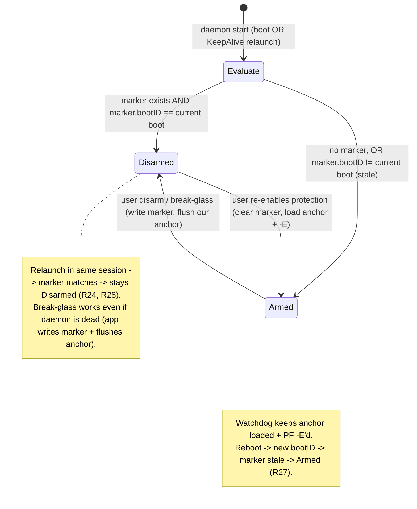
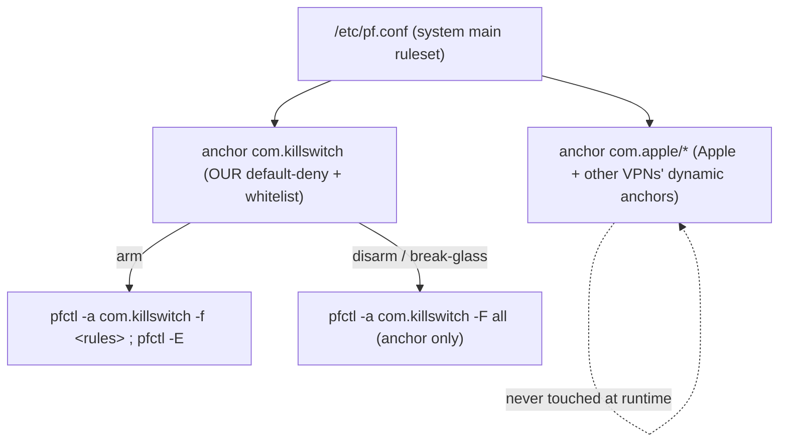

# fix: Reliable session-scoped OFF + surgical PF anchor for the VPN kill-switch

## Summary

Two fixes to the kill-switch's OFF behavior. (1) Make "turn protection off" actually reliable: a deliberate disarm (normal or break-glass) holds for the rest of the current boot session — surviving a daemon relaunch — but a real reboot returns to protected (R2 preserved). (2) Move our firewall rules into a dedicated PF anchor and use reference-counted enable, so disarming only ever clears our own rules and never rewrites or disables the system firewall that other VPNs depend on.

---

## Problem Frame

The kill-switch promised an always-available OFF switch that restores the internet. In a real incident it failed twice over (see origin: `docs/brainstorms/2026-06-08-vpn-kill-switch-reliable-off-requirements.md`).

- **OFF was undoable.** The daemon runs with `KeepAlive=true` (`Daemon/com.killswitch.daemon.plist`), so launchd/smd relaunches it within seconds of any stop. The boot path force-re-arms protection on every start (`Daemon/DaemonBootstrap.swift`). So the break-glass (`App/EmergencyOff.swift`), the SIGTERM handler (`Daemon/main.swift`), and the old uninstall — all of which only stopped the daemon — were undone by relaunch + re-arm. Only a permanent `launchctl disable` made a stop stick, which is too blunt (it survives reboot and would defeat auto-protect).

- **OFF broke other VPNs.** The disarm path ran `pfctl -f /etc/pf.conf` (replace the whole main ruleset) + `pfctl -d` (disable PF globally) (`Daemon/PFRulesetManager.swift`). The system `/etc/pf.conf` warns explicitly: the main ruleset must not be flushed because other services dynamically insert anchors into it, and components should enable/disable PF via reference counts (`-E`/`-X`) so PF is only disabled when the last reference is released. Our blunt reset wiped a coexisting VPN's rules and disabled PF for everyone — so disarming our protection killed the internet for a PF-dependent VPN, while a non-PF VPN was unaffected.

The strict "always protected from boot" posture was originally accepted *because* an always-working OFF exists. This plan makes that OFF real without weakening the posture.

---

## Requirements

Carried from the origin requirements doc. R35 (approval list never hides the needed server) and the ~1700-request flood are deferred (see Scope Boundaries).

### Reliable, session-scoped OFF (origin KTD7, R13)

R24. Any OFF path (normal toggle and break-glass) immediately restores the internet and cannot be undone by an automatic daemon relaunch: a daemon relaunched in the same boot session (incl. via `KeepAlive`) does not re-arm protection.

R25. Break-glass works even when the daemon is hung or dead: it clears our firewall rules directly with admin rights (one password prompt) and does not depend on the daemon answering.

R26. OFF paths use no actions that are irreversible across reboot (e.g., a permanent `launchctl disable`), so auto-protect after reboot (R27) keeps working.

### Boot-session boundary and auto-protect (preserves R2, R3)

R27. A deliberate disarm holds for the rest of the current boot session and survives a daemon relaunch, but a real reboot returns to protected automatically — the "always protected after reboot" policy (R2) is preserved.

R28. Both the boot path and the watchdog (R3) honor a "disarmed in this boot session" signal: while the signal is set and belongs to the current boot, protection is not raised; on a new boot the signal is treated as stale and ignored.

### Surgical PF — coexist with other VPNs

R29. All our firewall rules live in a dedicated PF anchor. We never overwrite the system main ruleset and never disable the packet filter globally.

R30. Enabling/disabling protection and the break-glass touch only our anchor. Rules installed by other VPN clients and tools are left intact — another active VPN keeps working.

R31. Completeness invariant: because we only ever write rules into our anchor, flushing the anchor always removes all of our blocking. No "nuclear" global-disable button is needed or used.

R32. If the packet filter must be enabled for our anchor to take effect, we enable it with a reference (`-E`); disarm releases our reference (`-X`) and never disables PF globally while other references remain.

### Visible confirmation (part of a trustworthy OFF, R33)

R33. After OFF, the app explicitly confirms protection is off and the internet should work; if clearing failed, it shows an explicit error rather than a silent no-op.

### Existing dependency to verify (R34)

R34. The control app launches at login (already implemented, commit d1b7625) so the OFF control is reachable after a reboot — the safety precondition for auto-protect. This plan verifies it still holds; no new work expected.

---

## Key Technical Decisions

- **Reference-counted enable (`-E`/`-X`), not `-e`/`-d`.** The system `/etc/pf.conf` mandates this: PF is disabled only when the last enable reference is released, which is exactly how we coexist with other PF users. The current code deliberately used `-e`/`-d` and avoided `-E` to dodge reference accumulation — but balanced `-E` on arm / `-X` on disarm is the correct fix, not avoidance. Replaces the global `pfctl -d` that broke coexistence (R29, R32).

- **Rules live in a dedicated anchor; the main ruleset is never flushed at runtime.** Our default-deny + whitelist move into a named anchor (e.g. `com.killswitch`). Disarm flushes only that anchor (`pfctl -a <anchor> -F all`). We never run `pfctl -f /etc/pf.conf` at runtime. This is the structural fix for "OFF broke other VPNs" (R29, R30, R31).

- **Anchor enforcement requires a one-time reference in `/etc/pf.conf`.** PF only evaluates anchors referenced from the loaded main ruleset, and the system main ruleset references only `com.apple/*`. So a single `anchor "com.killswitch"` (+ matching nat/rdr anchor points as the spike determines) is added to `/etc/pf.conf` idempotently at install/first start; the watchdog re-adds it if an OS update or another tool removed it. This is the *only* main-ruleset touch, and it is additive and install-time — runtime on/off never modifies the main ruleset. Validated by U1 before the rewrite lands.

- **Session disarm is a marker file keyed on boot time.** A marker (under the daemon state dir) records the current boot session id (`sysctl kern.boottime`). Disarm writes it; the boot path and watchdog treat protection as disarmed only when the marker exists AND its boot id equals the current boot. A real reboot changes the boot id, so the marker is stale and protection re-arms (R27, R28). This replaces `DaemonBootstrap`'s unconditional force-re-arm. Chosen as a separate marker file (not a field in `state.json`) so the app-side break-glass can write the durable signal directly without rewriting the daemon's structured state.

- **Break-glass stays daemon-independent but stops being blunt.** It no longer runs `launchctl disable`, `pfctl -d`, or `pfctl -f /etc/pf.conf`. It writes the session marker (admin) and flushes our anchor only. A relaunched daemon reads the marker and stays disarmed; other VPNs and the global PF state are untouched (R25, R26, R31).

- **A leaked `-E` reference on daemon crash is acceptable.** If the daemon dies without `-X`, PF stays enabled with our anchor empty — no blocking by us, others unaffected, and the count resets on reboot. Fail-safe in the right direction.

---

## High-Level Technical Design

### Boot / disarm / relaunch / reboot state logic

The core change: the daemon's "should I be armed right now?" decision consults the boot-session disarm marker instead of force-arming on every start.

### PF layering: where our rules sit

Directional, authoritative for the approach; exact anchor points (nat/rdr/scrub vs. filter only) are confirmed in U1.

---

## Implementation Units

Sequenced: U1 (spike) gates the rest. Fix #2 (surgical PF) is U2–U3; Fix #1 (reliable session OFF) is U4–U9; U10 aligns the panic script.

### U1. Spike: validate the anchor + reference-count model on the real machine

- **Goal:** De-risk the whole rewrite before changing the firewall engine. Confirm, on the actual Mac with a second VPN running, that: (a) our rules in a `com.killswitch` anchor referenced from `/etc/pf.conf` enforce default-deny with the same no-leak guarantees as today; (b) `-E`/`-X` reference counting keeps PF enabled for the other VPN after we release; (c) flushing only our anchor restores the internet without touching the other VPN; (d) `sysctl kern.boottime` gives a stable per-boot id.
- **Requirements:** R29, R31, R32, R28 (boot id).
- **Dependencies:** none.
- **Files:** none committed (scratch commands + notes). Findings recorded back into this plan's KTDs / Risks if the approach must change.
- **Approach:** Manually load a minimal anchor + `/etc/pf.conf` reference; verify enforcement and precedence vs. the `com.apple` anchors (the R19 backstop concern — our anchor's `block out` must remain the last match for non-quick fallthrough). Bring up a second VPN; confirm arm/disarm leaves it intact. Record exact anchor points needed.
- **Execution note:** Spike — real-machine verification, no production code. Produces a go / adjust-approach decision. Resolves the origin's two deferred-to-planning questions.
- **Test scenarios:** Test expectation: none — manual real-machine spike; outcome is a written go/no-go, not code.
- **Verification:** Documented evidence that default-deny holds (real IP not visible to a known-blocked probe), the coexisting VPN survives arm→disarm→arm, and boot id is stable within a session and changes across reboot.

### U2. PFRulesetManager: anchor-scoped rules + reference-counted enable + anchor-only OFF

- **Goal:** Rework the PF engine so all rules live in our anchor, enable uses `-E`/`-X`, and OFF flushes only our anchor — never the main ruleset, never global `-d`.
- **Requirements:** R29, R30, R31, R32.
- **Dependencies:** U1.
- **Files:** `Daemon/PFRulesetManager.swift`, `Tests/DaemonTests/PFRulesetManagerTests.swift`.
- **Approach:** Load via `pfctl -a <anchor> -f` instead of replacing the main ruleset. Replace `enable()`/`disable()` (`-e`/`-d`) with reference-counted `-E`/`-X`, tracking our reference token. Reframe `restoreSystemDefault()` into `clearOurAnchor()` (flush `-a <anchor> -F all` + `-X` our reference); remove all `pfctl -f /etc/pf.conf` and `pfctl -d` usage. Update `isRulesetLoaded()` to inspect our anchor (`pfctl -a <anchor> -sr`) rather than the main ruleset, and `isPFEnabled()` semantics for the reference model. Keep the bounded-timeout `exec` wrapper.
- **Patterns to follow:** Existing `makeRuleset` text generation and the `runTolerating` helper for idempotent "already enabled/disabled" handling.
- **Test scenarios:**
  - makeRuleset still emits default-deny, IPv6 block, DHCP/mDNS passes, per-utun passes, `<servers>` passes, LAN toggle, and the R19 `block out quick inet all` backstop, now shaped for anchor evaluation.
  - Covers AE3. With a fake PF, disarm calls anchor-flush + reference-release and never the main-ruleset-replace or global-disable operations.
  - Invalid server address still rejected before any apply (no partial anchor load).
  - `isRulesetLoaded()` reports loaded only when our anchor holds the `<servers>` reference; reports not-loaded after an anchor flush.
- **Verification:** Unit tests green; live (in U1's harness) the anchor enforces and disarm restores the internet with the other VPN intact.

### U3. Anchor reference bootstrap in /etc/pf.conf (idempotent) + watchdog re-add

- **Goal:** Ensure the system main ruleset references our anchor so it is evaluated, additively and idempotently, and self-heal if the reference disappears.
- **Requirements:** R29, R32.
- **Dependencies:** U1, U2.
- **Files:** `Daemon/PFRulesetManager.swift` (or a small new `Daemon/PFAnchorInstaller.swift`), `Daemon/Watchdog.swift`, `Tests/DaemonTests/PFRulesetManagerTests.swift`, `Tests/DaemonTests/WatchdogTests.swift`.
- **Approach:** On first arm, check whether `/etc/pf.conf` already contains our anchor reference; if not, append it (and the nat/rdr anchor points U1 found necessary) without rewriting existing lines, then trigger a single main-ruleset reload so it takes effect. Make the check idempotent (no duplicate lines on repeat). Watchdog: when armed and our anchor reference is missing from the live main ruleset, re-add (rare path — OS update / aggressive third-party flush). Keep the reload to the minimum necessary, since it momentarily re-reads the main ruleset.
- **Patterns to follow:** Watchdog's existing reconcile "detect drift → repair" loop and `lastApplied` guard to avoid thrashing.
- **Test scenarios:**
  - Idempotent add: given a pf.conf without our reference → reference added once; given one already containing it → no change, no duplicate.
  - Watchdog: armed + anchor reference present + rules loaded → no action; armed + reference missing → re-add path invoked (fake PF).
  - Disarmed-this-session → watchdog never re-adds or re-arms.
- **Verification:** Unit tests green; live, a reboot brings the anchor up enforced from first boot.

### U4. Boot-session identity + disarm marker (shared helper)

- **Goal:** A single source of truth for "is protection disarmed for this boot session?" usable by both the daemon and the app-side break-glass.
- **Requirements:** R27, R28, R26.
- **Dependencies:** U1 (boot-id mechanism confirmed).
- **Files:** `Shared/SessionDisarm.swift` (new), `Shared/Constants.swift` (marker path), `Tests/DaemonTests/SessionDisarmTests.swift` (new).
- **Approach:** Read the boot session id from `sysctl kern.boottime`. Provide `setDisarmed(currentBootID)`, `clearDisarmed()`, and `isDisarmedThisSession()` over a marker file in the daemon state dir (root-owned, owner-only perms like the existing state dir). `isDisarmedThisSession()` is true only when the marker exists and its stored boot id equals the live boot id; a mismatched (stale) marker reads as not-disarmed and is safe to clear on next arm.
- **Patterns to follow:** `StateStore` atomic write (temp + rename) and `0o700` directory perms.
- **Test scenarios:**
  - Set then read in the same (injected) boot id → disarmed true.
  - Marker with a different boot id → disarmed false (stale).
  - No marker → disarmed false.
  - Clear removes the marker; subsequent read is false.
  - Corrupt/empty marker → treated as not-disarmed (fail toward protected).
- **Verification:** Unit tests green with an injectable boot-id provider.

### U5. DaemonBootstrap: honor the session marker instead of force-re-arming

- **Goal:** Replace the unconditional "always boot protected" force with "arm unless disarmed in this same boot session."
- **Requirements:** R27, R28.
- **Dependencies:** U2, U4.
- **Files:** `Daemon/DaemonBootstrap.swift`, `Tests/DaemonTests/DaemonBootstrapTests.swift`.
- **Approach:** At start, consult `isDisarmedThisSession()`. If disarmed-this-session → do not load the anchor / do not `-E`; leave protection off and ensure our anchor is clear. Otherwise → clear any stale marker, load the anchor, `-E`, and (as today) correct persisted intent to protected. Preserves R2 for real reboots (stale marker) while respecting a same-session disarm across a KeepAlive relaunch.
- **Patterns to follow:** Existing `start()` ordering (load rules before enable) and its persisted-state correction block.
- **Test scenarios:**
  - Covers AE1. No marker (fresh boot) → arms; persisted intent corrected to protected.
  - Covers AE2. Marker for current boot (relaunch) → does NOT arm; anchor left clear.
  - Stale marker (different boot id) → arms and clears the stale marker.
  - Arm failure path still exits for launchd restart (unchanged), and does not write a disarm marker.
- **Verification:** Unit tests green; live, disarm → kill daemon → relaunch stays off; disarm → reboot comes back protected.

### U6. CommandHandler + Watchdog: marker-aware disarm and reconcile

- **Goal:** Normal disarm writes the session marker and clears our anchor; the watchdog never re-arms while disarmed-this-session.
- **Requirements:** R24, R28, R30.
- **Dependencies:** U2, U4.
- **Files:** `Daemon/CommandHandler.swift`, `Daemon/Watchdog.swift`, `Tests/DaemonTests/CommandHandlerTests.swift`, `Tests/DaemonTests/WatchdogTests.swift`.
- **Approach:** `setProtection(false)` → write session marker (current boot id) + clear our anchor (U2) under the shared lock; `setProtection(true)` → clear marker + load anchor + `-E`. Watchdog `reconcile()` short-circuits to "leave alone" when `isDisarmedThisSession()` (in addition to the existing persisted-flag check), closing the window where a relaunched-but-not-yet-bootstrapped state could race.
- **Patterns to follow:** The shared `NSLock` between CommandHandler and Watchdog; "persist intent before touching the kernel" ordering.
- **Test scenarios:**
  - Disarm writes the marker and calls anchor-clear (fake PF); re-enable clears the marker and reloads.
  - Watchdog with disarmed-this-session marker → reconcile is a no-op even if PF/anchor look "down."
  - Watchdog armed + anchor flushed externally → reloads anchor (drift repair).
  - Disarm then a watchdog tick in the same session → still disarmed (no re-arm).
- **Verification:** Unit tests green.

### U7. SIGTERM handler: anchor-only teardown, no global reset

- **Goal:** On daemon stop, remove our blocking without harming other PF users.
- **Requirements:** R29, R30, R32.
- **Dependencies:** U2.
- **Files:** `Daemon/main.swift`.
- **Approach:** Replace `restoreSystemDefault()` in the SIGTERM handler with: stop watchdog, take the shared lock, flush our anchor + `-X` our reference, exit. No `pfctl -d`, no `/etc/pf.conf` reload. Does not write a disarm marker (a kill without a user disarm should re-arm on relaunch — correct), so it does not interfere with R27/R28.
- **Patterns to follow:** Existing SIGTERM ordering (stop watchdog → lock → act → exit).
- **Test scenarios:** Test expectation: none — `main.swift` is excluded from the unit-test target; verify live (uninstall/stop leaves the other VPN working).
- **Verification:** Live — stopping the daemon restores our portion only; a coexisting VPN keeps working.

### U8. EmergencyOff (break-glass): marker + anchor flush, drop the blunt steps

- **Goal:** Make the daemon-independent break-glass both effective against relaunch and safe for other VPNs.
- **Requirements:** R24, R25, R26, R31.
- **Dependencies:** U2, U4.
- **Files:** `App/EmergencyOff.swift`.
- **Approach:** Replace the admin shell (`launchctl bootout` + `pfctl -f /etc/pf.conf` + `pfctl -d`) with: write the session disarm marker (current boot id) to the root-owned marker path, then flush our anchor only (`pfctl -a <anchor> -F all`). Keep the single `osascript ... with administrator privileges` invocation and the discard-stdout / drained-stderr handling. The relaunched daemon reads the marker and stays disarmed (R24); PF global state and other anchors are untouched (R31).
- **Patterns to follow:** Existing `EmergencyOff.run()` structure, outcome enum, and `-128`/"User canceled" handling.
- **Test scenarios:** Test expectation: none — `App/` is outside the unit-test target; verify live.
- **Verification:** Live — with the daemon force-hung, break-glass restores the internet, survives the KeepAlive relaunch (stays off this session), and a coexisting VPN is unaffected; after reboot, protection returns.

### U9. Visible OFF confirmation in the UI

- **Goal:** The user can see that OFF worked (or clearly failed) — no silent no-op.
- **Requirements:** R33.
- **Dependencies:** U6, U8.
- **Files:** `App/MenuBarController.swift`, `App/EmergencyOff.swift` (outcome surfacing), relevant view (`App/KillSwitchApp.swift` / menu view).
- **Approach:** After a disarm or break-glass resolves, surface an explicit state: "Защита выключена — интернет должен работать" on success, or a clear error string on failure. Reuse the existing `lastError`/status plumbing and the post-action `refresh()`; add a transient success confirmation distinct from the steady disarmed-icon state.
- **Patterns to follow:** Existing `isEmergencyRunning` / `lastError` handling in `MenuBarController` and the status-icon derivation.
- **Test scenarios:** Test expectation: none — app-side UI, outside the unit-test target; verify live that success and failure are both visibly distinct.
- **Verification:** Live — pressing OFF shows a clear confirmation; a simulated failure shows an explicit error.

### U10. Align the panic / uninstall + diagnose scripts with the surgical model

- **Goal:** The terminal panic button and diagnostics match the new model — never globally reset PF, and reflect anchor-scoped state.
- **Requirements:** R29, R30, R31 (the panic path must also not break other VPNs).
- **Dependencies:** U2, U3.
- **Files:** `scripts/ks-uninstall.sh`, `scripts/ks-diagnose.sh`.
- **Approach:** Uninstall is *permanent removal*, so a persistent `launchctl disable` is appropriate there (distinct from the in-session escape, which must not). Replace the global `pfctl -f /etc/pf.conf` + `pfctl -d` with: flush our anchor + remove our `/etc/pf.conf` reference line we added (U3) + release/skip global disable. Reconcile the currently-uncommitted stopgap edits to `scripts/ks-uninstall.sh` into this final shape. Update `ks-diagnose.sh` to report anchor presence/contents and the PF reference state instead of assuming we own the main ruleset.
- **Patterns to follow:** Existing step-by-step Russian-language script structure and "push through every step even on failure" (`|| true`).
- **Test scenarios:** Test expectation: none — shell scripts; verify by running on the machine.
- **Verification:** Live — uninstall removes our anchor + reference and leaves a coexisting VPN working; diagnose accurately reports the anchor-scoped state.

---

## Scope Boundaries

### In scope

- The two fixes: reliable session-scoped OFF + auto-protect (R24–R28, R33), and surgical PF anchor coexistence (R29–R32). R34 is verify-only.

### Deferred to Follow-Up Work

- **Approval list never hides the needed server (R35).** The candidate-filter fallback so an unrecognized VPN client's server is still shown. Separate work per the user's request.
- **The ~1700 permission-request flood.** Root-caused informally (long block → retries pile up) but its own investigation and fix.

### Outside this product's identity (unchanged from origin)

- No NetworkExtension rewrite — stay on PF.
- Notarization / polished install still deferred (personal version).
- No protection against a compromised root — admin can always disable PF.

---

## Risks & Dependencies

- **Anchor enforcement & precedence (highest risk).** If our anchor's `block out quick inet all` backstop is not the last-matching non-quick rule once nested under the main ruleset, a leak path could open (the origin R19 concern). U1 must confirm precedence vs. `com.apple/*` and any third-party anchors before U2 lands. Mitigation: keep the explicit `block out quick inet all` backstop inside our anchor.
- **`/etc/pf.conf` edits get clobbered.** An OS update or an aggressive third-party tool may rewrite the main ruleset and drop our reference, silently disabling enforcement. Mitigation: watchdog re-add (U3) + diagnose surfacing (U10). Residual: a brief unenforced window until the watchdog repairs — acceptable per the fail-open posture, but noted.
- **Main-ruleset reload momentarily re-reads pf.conf.** Adding our reference (U3) requires one main-ruleset reload, which can transiently drop other tools' dynamically-inserted anchors at that instant. Mitigation: do it rarely (install/first-arm and only-when-missing), never on routine on/off.
- **`-E` reference leak on crash.** Accepted (KTD) — fail-safe (PF stays on, our anchor empty; resets on reboot).
- **App-side units are unverified by unit tests.** U7–U10 live in `main.swift`, `App/`, and shell, all outside `KillSwitchDaemonTests`. They rely on live verification; the spike harness (U1) should be reused as the live test bed.

---

## Acceptance Examples

Carried from origin (AE5 deferred with R35).

- AE1. Given the user disarmed protection, when the Mac reboots, then protection is on again after boot and the real IP cannot leak. (R27, R28 — U5)
- AE2. Given protection is disarmed in the current session, when the daemon relaunches (`KeepAlive`) without a reboot, then protection stays off and the internet is reachable. (R24, R28 — U5, U6)
- AE3. Given another PF-using VPN is active, when the user disarms our protection, then the other VPN's rules are untouched and its internet keeps working. (R29, R30, R32 — U2)
- AE4. Given the daemon is hung, when the user runs break-glass and authenticates, then our blocking is cleared, the internet returns, and a relaunch does not restore it this session. (R25, R26, R28, R31 — U8)

---

## Sources / Research

- Origin requirements: `docs/brainstorms/2026-06-08-vpn-kill-switch-reliable-off-requirements.md`.
- Incident root-cause analysis: this session's ce-debug pass (two design-level causes — KeepAlive + force-re-arm; global PF reset).
- System constraint: `/etc/pf.conf` header — "main ruleset must not be flushed… nested anchors rely on the anchor point"; "enable/disable PF via `-E` and `-X`… disabled only when the last enable reference is released." Direct basis for the anchor + reference-count KTDs.
- Current behavior under change: `Daemon/PFRulesetManager.swift` (`restoreSystemDefault`, `enable`/`disable`), `Daemon/DaemonBootstrap.swift` (force-re-arm), `Daemon/main.swift` (SIGTERM), `App/EmergencyOff.swift` (break-glass), `Daemon/com.killswitch.daemon.plist` (`KeepAlive`).
- Prior follow-ups: `docs/review-followups-stage-bcd.md` (boot-lockout fix, break-glass, "always protected after reboot" posture) and `docs/solutions/tooling-decisions/macos-privileged-daemon-pf-killswitch-setup.md` (pfctl/SMAppService gotchas).
- Existing tests to extend: `Tests/DaemonTests/{PFRulesetManagerTests,DaemonBootstrapTests,WatchdogTests,CommandHandlerTests,StateStoreTests}.swift`.
