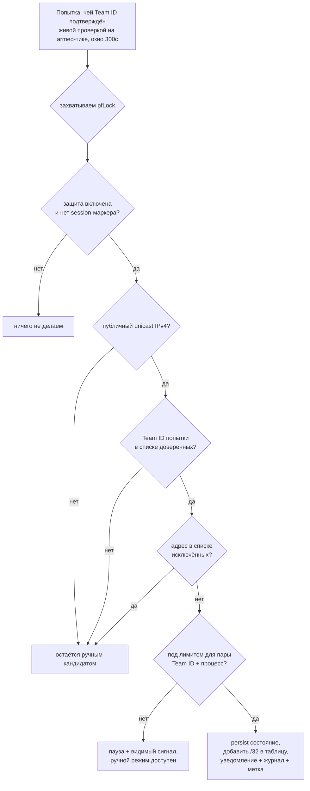

# feat: Авто-разрешение серверов для доверенных VPN-клиентов

## Summary

Пользователь один раз доверяет VPN-приложению; доверие привязано к подписи разработчика (Team ID), которую демон проверяет у живого процесса. После этого демон сам добавляет в белый список серверы, к которым стучится подписанный доверенным Team ID процесс — так молчаливая ротация пула серверов больше не ломает интернет. Фаервол остаётся default-deny и не ослабляется: автоматизируется только ведение списка `<servers>`, под проверкой подписи, с уведомлениями, журналом, лимитом и отзывом. Сюда же входит фильтр локального шума (`::1`) в списке кандидатов.

---

## Problem Frame

Инцидент 2026-06-10 (`docs/solutions/integration-issues/vpn-endpoint-rotation-pf-whitelist-blocks-new-connections.md`): v2RayTun берёт серверы из пула и ротирует их без предупреждения. В белом списке был один адрес, поэтому после самопереподключения клиента каждое НОВОЕ соединение на машине тихо умирало (~2 c, таймаут набора реле), а старые жили. Ручное одобрение каждого сервера не поспевает за клиентом, который меняет точки по своему графику — каждая ротация это новый молчаливый «отказ интернета». Отдельно список кандидатов засоряли петлевые самоподключения клиента (`::1:<ephemeral>`), однажды давшие ~1700 бессмысленных запросов.

Эта работа реализует то, что сам инцидент-док назвал нужным («auto-approve new candidates from an already-approved client process» + «notify-on-block»), и закрывает R35/AE5 из `docs/brainstorms/2026-06-08-vpn-kill-switch-reliable-off-requirements.md`.

---

## Requirements Traceability

Требования R1–R12 и приёмочные примеры AE1–AE6 взяты из origin-документа (`docs/brainstorms/2026-06-10-trusted-client-auto-approval-requirements.md`). R13 добавлено планом по результатам ресёрча (см. ниже) — в origin его нет.

| Требование | Где реализуется |
|---|---|
| R1. Доверие даётся вручную, одним действием | U5, U9 |
| R2. Доверие привязано к проверенной подписи (Team ID) живого процесса | U2, U3, U4, U5 |
| R3. Нельзя проверить подпись → автоматики нет, ошибка объясняется | U3, U4, U5 |
| R4. Доверенный клиент → новый публичный IPv4 разрешается за секунды | U4, U6 |
| R5. IPv6 остаётся полностью заблокирован, автоматика его не трогает | U6 |
| R6. Авто-разрешения ограничены лимитом, при упоре — видимый сигнал | U6, U9 |
| R7. Пока защита выключена — автоматика бездействует (вкл. boot-маркер) | U6 |
| R8. Каждое авто-разрешение заметно: уведомление + журнал + метка | U6, U9 |
| R9. Авто-серверы удаляются как обычные; удаление исключает из авто-добавления | U2, U7 |
| R10. Отзыв доверия немедленно останавливает автоматику для приложения | U5, U9 |
| R11. Ручной режим сохраняется как универсальный запасной | U5, U9 (без изменений в существующем коде) |
| R12. Петлевые адреса (`::1`, `127.0.0.0/8`) никогда не попадают в кандидаты | U1 |
| R13 (новое, из ресёрча). Смена подписи доверенного приложения → видимое «доверие приостановлено» | U8, U9 |

R13 добавлено по результатам ресёрча и подтверждено пользователем (2026-06-10): при обновлении приложения его Team ID может смениться — без видимого предупреждения это вернуло бы ровно ту молчаливую поломку, ради которой делается фича.

---

## Key Technical Decisions

- KTD1. **Проверка по audit-токену, а не по «голому» PID.** Ресёрч (Objective-See LuLu, North Pole Santa, Apple DTS) показал реальную гонку: между моментом, когда сканер увидел соединение, и проверкой подписи процесс может завершиться и PID переиспользоваться, либо процесс подменён через exec. Демон (root, без entitlements) переводит PID в `audit_token_t` (`task_name_for_pid` + `task_info(TASK_AUDIT_TOKEN)`) и проверяет через `kSecGuestAttributeAudit` — токен включает `pidversion` и однозначно называет ровно один экземпляр процесса. Любая невозможность связать (процесс ушёл, токен не читается) → fail-closed (автоматики нет, работает ручной режим). Дешёвый fail-closed: клиент сам повторит попытку, и она будет переосмотрена вживую.

- KTD2. **Проверка через требование подписи, а не сравнение строк.** Строим `SecRequirement` один раз (`SecRequirementCreateWithString`) формой Developer-ID из Apple TN3127 (`anchor apple generic` + Developer-ID OID-ы промежуточного и листового сертификатов + `certificate leaf[subject.OU] = TEAMID`) и передаём третьим аргументом в `SecCodeCheckValidity(code, kSecCSDefaultFlags, requirement)`. Сетевые проверки отзыва НЕ включаем (`kSecCSEnforceRevocationChecks` может зависнуть на пути принятия решения). Team ID читаем (`kSecCodeInfoTeamIdentifier`) только ПОСЛЕ успешной валидности; ad-hoc и платформенные бинарники (нет Team ID) → недоверенные. Проверяем ЖИВОЙ процесс (`SecCode`), не путь на диске — туннельные расширения запускаются из staged-копий (`/Library/SystemExtensions/<UUID>/…` или `/private/var/folders/.../X/…`), любая проверка по пути сломалась бы.

- KTD3. **Авто-разрешение идёт по тому же залоченному пути, что и ручное.** Это третий писатель в PF (после watchdog и CommandHandler). Чтобы не было гонок с перезагрузкой anchor watchdog'ом и с break-glass, мутация переиспользует логику `CommandHandler.allowServer` под общим `pfLock`, а проверка «защита включена И нет session-маркера» делается ВНУТРИ критической секции — ровно как watchdog (`Watchdog.reconcile()`), который короткозамыкается на `isDisarmedThisSession()`. Так выполняется AE6 без гонок (см. `docs/solutions/tooling-decisions/macos-privileged-daemon-pf-killswitch-setup.md`, «Never fight OFF»).

- KTD4. **Критерий авто-одобрения — ЖИВОЕ подтверждение подписи при ВКЛЮЧЁННОЙ защите, а не «время первого появления».** (Уточнено по ревью, ADV-3/ADV-4.) Образец авто-одобряем тогда и только тогда, когда его Team ID подтверждён живой проверкой на тике, выполненном при armed-защите без session-маркера. Окно 300 c меряется от момента этого живого подтверждения, НЕ от первого появления образца в буфере. Следствия: (а) действующее соединение клиента к нужному серверу (сокет `ESTABLISHED`) после disarm→rearm авто-одобряется — процесс жив, подпись подтверждается сейчас, и сервер не «застревает» вне белого списка (важный путь инцидента — «тоггл, чтобы держать интернет»); (б) «залп часовой давности» предотвращается сам собой: процессы, ушедшие за время OFF, не пройдут живую проверку (вернут `nil`), поэтому их старые образцы не одобряются. Признак «из OFF-периода» отдельно не хранится — единственный критерий — живое подтверждение при armed.

- KTD5. **Обратносовместимая загрузка состояния — критично.** `PersistedState` сейчас — синтезированный `Codable` без `decodeIfPresent`. Любое новое НЕ-опциональное поле без значения по умолчанию приведёт к падению декодирования старого `state.json`, а `StateStore.load()` тогда молча откатится к `.defaults`, СТЕРЕВ белый список серверов (это и есть класс инцидента, который мы чиним). Новые поля (`trustedClients`, `excludedAddresses`, `ServerRule.origin`) добавляются через кастомный `init(from:)` с `decodeIfPresent`/значениями по умолчанию. Обязателен тест «старый state.json без новых полей грузится без потери серверов». Также `scripts/ks-test-install.sh` сеет `state.json` с текущими ключами — новые поля должны оставаться опциональными на диске.

- KTD6. **Ключ доверия — Team ID.** Он покрывает и приложение, и его туннельное расширение (у v2RayTun оба `2XZUN9L63Z`, проверено `codesign` 2026-06-10) — что необходимо, ведь дозванивается именно расширение `packet-extension-mac`, а не «приложение», как его видит пользователь. В записи доверия храним Team ID (точка принуждения) плюс отображаемое имя и наблюдавшиеся имена процессов. Лимит и состояние «приостановки» ведутся по паре **(Team ID + имя дозванивающего процесса)**, а не по «приложению» вообще (уточнено по ревью, ADV-2): у одного Team ID может одновременно работать и GUI-часть приложения (своя телеметрия/обновления), и туннельное расширение `packet-extension-mac` — если вести один счётчик на Team ID, шум GUI выберет лимит и задушит авто-разрешение реле, то есть главную функцию. Поэтому авто-одобрение применяется к соединениям дозванивающего процесса (наблюдавшееся имя расширения), и лимит считается на него. Список исключённых адресов — глобальный.

- KTD7. **Лимит: скользящее окно 1 час, по умолчанию 10, СЧЁТЧИК В ПАМЯТИ.** Защита и от шума, и от скомпрометированного доверенного клиента, дозванивающегося на множество адресов. Счётчик и состояние паузы держим в памяти и сбрасываем при перезапуске демона — не персистируем (упрощено по ревью, SG-02): это личный инструмент на собственном ноутбуке, и «обход лимита перезапуском своего же демона» не является угрозой, а персистирование добавило бы ещё одно поле в `state.json` с рисками KTD5 без реальной пользы. Авто-возобновление по истечении окна, засчитываются только свежие попытки. Сигнал паузы ведёт пользователя к ручному режиму (R11). Точное число — настраиваемая константа.

- KTD8. **Фильтр петли — в IPv6-ветке `keep()`.** IPv4-петля (`127/8`) уже отсекается `AddressRules.isPublicUnicastIPv4`; «потоп 1700» шёл через `::1`, который проходит как IPv6-диагностический кандидат. Фильтруем петлю и link-local (`fe80::/10`) в `ConnectionObserver.keep()`, оставляя ПУБЛИЧНЫЙ IPv6 диагностическим кандидатом — иначе реализатор либо снесёт диагностику IPv6 целиком, либо «починит» уже исправную IPv4-сторону.

- KTD9. **Своевременность наблюдения: запомнить попытку и переподтвердить при повторе.** (Добавлено по ревью, ADV-1.) Сокет в `SYN_SENT` к заблокированному серверу живёт ~2 c (таймаут набора реле), а сканер тикает раз в 3 c — есть риск систематически не успевать поймать живой сокет, и тогда авто-разрешитель не одобрит НИКОГДА, livelock'аясь на «нечего одобрять» при зелёных юнит-тестах (тесты инъецируют готовый образец). Снятие риска двумя совместимыми мерами: (1) уменьшить интервал скана наблюдателя до заметно меньше таймаута реле (целимся ~1 c при ~2 c смерти сокета — настраиваемо); (2) НЕ полагаться на единичный «поймали живым» — наблюдатель помнит недавно виденные `(имя процесса, адрес, порт)` даже когда сокет исчез, и переподтверждает Team ID при СЛЕДУЮЩЕМ появлении того же `SYN_SENT` (клиент повторяет попытки сам). Реальный измеренный интервал скана vs. наблюдаемый срок жизни `SYN_SENT` зафиксировать живой проверкой на железе (приёмка U6).

- KTD10. **Сигнал авто-разрешения доходит до UI через опрос статуса, без обратного XPC.** (Добавлено по ревью, feasibility.) Существующий паттерн транзиентного баннера (`flashOffConfirmation`) запускается ДЕЙСТВИЕМ приложения, а не «пушем» от демона; XPC здесь односторонний (приложение→демон), обратного канала нет. Поэтому авто-разрешения, пауза по лимиту и «доверие приостановлено» выражаются ПОЛЯМИ в `DaemonStatus`, которые приложение и так читает 2-секундным опросом (`MenuBarController.refresh`), и при изменении этих полей приложение поднимает баннер локально. Никакого нового обратного XPC-интерфейса — это держит изменение в рамках существующей архитектуры опроса.

---

## High-Level Technical Design

Решение авто-одобрения одной попытки (U6). Проверки порядка важны: «защита включена + нет маркера» и сама мутация таблицы происходят под одним `pfLock`.

Привязка личности процесса (U3/U4): PID из сокет-скана → `audit_token_t` → `SecCodeCopyGuestWithAttributes(kSecGuestAttributeAudit)` → `SecCodeCheckValidity(…, requirement)` → читаем `kSecCodeInfoTeamIdentifier`. Вердикт кэшируется по `(pid, pidversion)`; «не проверено» означает «не доверять».

---

## Implementation Units

### U1. Фильтр петлевого/link-local шума в кандидатах

- **Goal:** `::1` и прочая петля/link-local больше не попадают в список кандидатов (корень «потопа 1700»).
- **Requirements:** R12.
- **Dependencies:** нет (можно слить первым, независимо от остального).
- **Files:** `Daemon/ConnectionObserver.swift` (новый предикат в `AddressRules` + вызов в `keep()`), `Tests/DaemonTests/ConnectionObserverTests.swift`.
- **Approach:** добавить `AddressRules.isLoopbackOrLinkLocal(_:)` (покрывает `::1`, `127.0.0.0/8` для полноты, `fe80::/10`); вызвать в начале `keep()` до возврата IPv6-диагностики, чтобы ПУБЛИЧНЫЙ IPv6 остался кандидатом (KTD8). IPv4-петля уже отсекается — предикат держит обе ветки в одном месте как единый источник правды.
- **Patterns to follow:** существующие чистые предикаты `AddressRules.isPublicUnicastIPv4`/`isInTunnel` и их юнит-тесты.
- **Test scenarios:**
  - Covers AE5. Образец `::1:<любой ephemeral>` не становится кандидатом; повтор с другим портом — тоже (раньше плодил строки).
  - `127.0.0.1` и `127.255.0.7` не становятся кандидатами.
  - `fe80::…` (link-local) не становится кандидатом.
  - Публичный IPv6 (`2606:4700::1111`) ОСТАЁТСЯ диагностическим кандидатом (не «починили» лишнего).
  - Публичный IPv4 сервер (`91.240.86.16`) по-прежнему проходит.
- **Verification:** новые тесты зелёные; вручную — список запросов больше не растёт от петлевого трафика клиента.

### U2. Модель данных: pid/подпись на образце, происхождение сервера, доверенные клиенты, исключения

- **Goal:** довести до моделей всё, что нужно остальным юнитам, с обратной совместимостью состояния.
- **Requirements:** R1, R2, R8, R9, R13.
- **Dependencies:** нет.
- **Files:** `Daemon/ConnectionObserver.swift` (`ConnectionSample` +pid +start-time/верифицированный Team ID), `Daemon/LibprocSocketScanner.swift` (прокинуть pid/время старта), `Shared/Models.swift` (`Candidate` +pid +флаг «проверен»; новая `TrustedClient`), `Daemon/StateStore.swift` (`PersistedState` +`trustedClients` +`excludedAddresses`; `ServerRule.origin`), `Tests/DaemonTests/StateStoreTests.swift`.
- **Approach:** `ConnectionSample` получает `pid: Int32?` и `processStartedAt`/идентификатор экземпляра (для привязки к точному процессу, KTD1); pid НЕ входит в ключ дедупликации (ротация pid не должна плодить строки). `ServerRule` получает `origin` (`manual`/`auto`) для метки R8 и различения в R9. Новые `PersistedState.trustedClients: [TrustedClient]` (Team ID + имя + наблюдавшиеся имена процессов) и `excludedAddresses: [String]`. Кастомный `PersistedState.init(from:)` с `decodeIfPresent` и значениями по умолчанию (KTD5). Даты — секундная точность, как в `ServerRule.init` (round-trip-идентичность для `Equatable`).
- **Patterns to follow:** `ServerRule.init` (усечение даты), синтезированный `Codable` в `Shared/Models.swift`, инъекция директории в `StateStore` для тестов.
- **Test scenarios:**
  - Старый `state.json` (только текущие 4 ключа) грузится: серверы и флаги целы, `trustedClients`/`excludedAddresses` пусты, `ServerRule.origin` по умолчанию `manual` (KTD5 — защита от стирания списка).
  - Round-trip нового состояния с доверенным клиентом и исключениями сохраняется идентично.
  - `ServerRule` с `origin = .auto` сериализуется и читается обратно.
  - `Candidate`/`ConnectionSample` несут pid после скана (через фейковый сканер).
- **Verification:** все тесты `StateStoreTests` зелёные, включая новый тест обратной совместимости; ручной запуск на реальном `state.json` не теряет серверы.

### U3. Проверка подписи живого процесса (Security framework)

- **Goal:** надёжно получить проверенный Team ID живого процесса по его PID.
- **Requirements:** R2, R3.
- **Dependencies:** нет (но потребляется U4/U5).
- **Files:** `Daemon/SignatureVerifier.swift` (новый: протокол `SignatureVerifying` + реальная реализация на Security framework), `Tests/DaemonTests/` (фейк-верификатор для остальных юнитов; реальную реализацию проверяем на железе).
- **Approach:** протокол-шов `SignatureVerifying { func verifiedTeamID(forPid: Int32) -> String? }` (как `SocketScanning`/`PFControlling`). Реальная реализация: PID → `audit_token_t` (`task_name_for_pid` + `task_info(TASK_AUDIT_TOKEN)`), затем `SecCodeCopyGuestWithAttributes(kSecGuestAttributeAudit)`, `SecCodeCheckValidity(code, kSecCSDefaultFlags, requirement)` с Developer-ID-требованием (KTD2), и только при успехе — `kSecCodeInfoTeamIdentifier`. Кэш вердиктов по `(pid, pidversion)`. Любая ошибка → `nil` («не доверять»). Без сетевых проверок отзыва. Подсистема субпроцесса/Security инжектируется, как пинятно в проекте (`pfctl`-runner) — реальные SecCode-вызовы недоступны в xctest-песочнице, поэтому юнит-тесты идут против фейка, а реальная проверка — под `KS_RUN_INTEGRATION=1`/на машине.
- **Patterns to follow:** инъекция шва ради тестируемости (`PFControlling`, `SocketScanning`), `docs/solutions/tooling-decisions/macos-privileged-daemon-pf-killswitch-setup.md` про «verified on hardware, not in sandbox».
- **Test scenarios (фейк-верификатор + контракт):**
  - Контракт: «не проверено» отдаёт `nil`, и потребители трактуют это как «не доверять» (проверяется в U4/U5).
  - На железе (ручная проверка, не CI): живой процесс `packet-extension-mac` под v2RayTun даёт Team ID `2XZUN9L63Z`; ad-hoc/неподписанный процесс даёт `nil`; платформенный бинарник даёт `nil` (нет Team ID).
- **Verification:** на реальной машине демон логирует корректный Team ID расширения v2RayTun; результат потом зафиксировать `/ce-compound` (нового знания по SecCode в репозитории ещё нет).
- **Execution note:** начать с контракта протокола и фейка; реальную реализацию проверять на железе, не в песочнице.

### U4. Живая привязка подписи в наблюдателе

- **Goal:** в момент наблюдения попытки сохранять на образце проверенный Team ID, привязанный к точному экземпляру процесса; иначе — пусто (fail-closed).
- **Requirements:** R2, R4.
- **Dependencies:** U2, U3.
- **Files:** `Daemon/ConnectionObserver.swift` (вызов верификатора в `refresh()`), `Tests/DaemonTests/ConnectionObserverTests.swift`.
- **Approach:** в `refresh()` для оставленных образцов **только тех, что в принципе авто-одобряемы (публичный unicast IPv4)** запросить `verifiedTeamID(forPid:)` и сохранить на `ConnectionSample` (KTD1: проверка в том же скан-проходе; привязка к экземпляру). IPv6-диагностические образцы НЕ верифицируем — они всё равно не одобряются (R5), а лишние SecCode-вызовы — трата (уточнено по ревью, ADV-5). Кэш в верификаторе не даёт проверять один процесс каждые 3 c. Если процесс уже ушёл — Team ID пуст, образец остаётся обычным (ручным) кандидатом (KTD4/R3). Реализовать «запомнить и переподтвердить» из KTD9: недавно виденные `(имя, адрес, порт)` помнятся даже когда сокет исчез, и Team ID переподтверждается при следующем появлении того же `SYN_SENT`.
- **Patterns to follow:** существующий `refresh()`/`keep()` поток; инъекция `now`/времени.
- **Test scenarios:**
  - Образец от процесса с проверяемым Team ID несёт этот Team ID (фейк-верификатор).
  - Образец от процесса без верификации несёт пустой Team ID и остаётся обычным кандидатом.
  - IPv6-кандидат НЕ вызывает верификатор (ADV-5) — проверка нулём вызовов фейка для IPv6-образца.
  - Верификатор зовётся не на каждый тик для одного pid (кэш) — проверка числа вызовов фейка.
- **Verification:** тесты зелёные; логика остаётся чистой/инъецируемой по времени.

### U5. Команды доверия: «доверять» / «не доверять»

- **Goal:** дать пользователю одно действие, чтобы доверить приложение за кандидатом, и отозвать доверие; проверка подписи происходит в демоне.
- **Requirements:** R1, R2, R3, R10, R11.
- **Dependencies:** U2, U3.
- **Files:** `Shared/IPCProtocol.swift`, `Daemon/CommandHandler.swift`, `Daemon/XPCService.swift`, `App/XPCClient.swift`, `Tests/DaemonTests/CommandHandlerTests.swift`.
- **Approach:** новые команды `trustClient(pid:label:)`, `untrustClient(teamID:)`, `fetchTrustedClients()`. `trustClient` верифицирует ЖИВОЙ процесс по pid (не по имени!), и при коллизии имени/нескольких живых процессах с этим именем — если различные Team ID или есть непроверяемые, грант падает с объяснением (расширяет R3, gap-2 из ресёрча). Если процесс уже ушёл — грант падает с подсказкой «откройте VPN-приложение и попробуйте снова». Идемпотентность (повторное доверие тому же Team ID не плодит запись). **После записи доверия немедленно прогнать один проход авто-разрешителя** для уже накопленных свежих, живо-проверенных образцов этого дозванивающего процесса (под тем же `pfLock`) — иначе пользователь жмёт «Доверять» и секунды ждёт следующего тика без признаков, что что-то происходит (закрывает отложенный вопрос origin, SG-04; рекомендация — «да, одобрять сразу»). Всё под `pfLock`, persist-then-mutate. Тонкие проброски XPC/клиента по образцу `allowServer`.
- **Patterns to follow:** сквозной паттерн команды (`allowServer`/`removeServer` → `ExportedDaemon.run` → `XPCClient.withResult`), русские строки ошибок в клиенте.
- **Test scenarios (фейк-верификатор):**
  - Covers AE1 (часть). `trustClient` для pid с проверяемым Team ID сохраняет запись доверия (Team ID + имя); идемпотентно при повторе.
  - Covers AE2. Процесс с непроверяемой подписью → грант падает, запись не создаётся, ошибка объяснена.
  - Несколько живых процессов с именем кандидата и разными Team ID → грант падает с объяснением.
  - Процесс ушёл к моменту гранта → грант падает с подсказкой про повторную попытку.
  - Covers AE4. `untrustClient` удаляет запись; уже одобренные серверы остаются (удаляются отдельно).
- **Verification:** `CommandHandlerTests` зелёные; на машине доверие v2RayTun проходит, отзыв — мгновенно.

### U6. Авто-разрешитель (фоновый компонент)

- **Goal:** периодически авто-одобрять свежие попытки доверенных клиентов под лимитом, исключениями и правилом «не воевать с OFF».
- **Requirements:** R4, R5, R6, R7, R8, R9.
- **Dependencies:** U2, U3, U4, U5, U7.
- **Files:** `Daemon/AutoApprover.swift` (новый), `Daemon/main.swift` (проводка), `Tests/DaemonTests/AutoApproverTests.swift` (новый).
- **Approach:** собственный `DispatchSourceTimer` на приватной очереди (шаблоны — `Watchdog.start()`, `ConnectionObserver.start()`), тик в такт сканеру (см. KTD9 про интервал). Каждый тик берёт `pfLock`; ВНУТРИ секции проверяет «защита включена И нет session-маркера» (KTD3) и затем для каждого кандидата, чей Team ID **подтверждён живой проверкой на armed-тике** (KTD4, окно 300 c от живого подтверждения): публичный IPv4 (R5 — IPv6 никогда), Team ID в доверенных, адрес не исключён, под лимитом для пары (Team ID + имя дозванивающего процесса) (KTD6/KTD7). Подходящий — persist-then-mutate через тот же залоченный путь, что и `allowServer` (метка `origin = .auto`, R8), журнал через общий `journal`-сток, и сигнал в UI через поле `DaemonStatus` (KTD10, без обратного XPC). При упоре лимита — выставить флаг паузы (в памяти) и НЕ одобрять (R6). На SIGTERM — останавливать вместе с watchdog (как в `main.swift`). Замечание по watchdog (gap-12): `allowServer` делает хирургический `pf.addServer` (точечная добавка в таблицу), НЕ полную перезагрузку anchor — на реализации убедиться, входит ли членство таблицы `<servers>` в строку ruleset, что сравнивает watchdog (`desired == lastApplied`); если да — обновлять baseline под общим локом, если нет — синхронизация не нужна.
- **Patterns to follow:** `Watchdog` (таймер + общий lock + проверка маркера), `CommandHandler.allowServer` (persist-then-mutate), инъекция `now`/лимита/верификатора для чистых тестов.
- **Test scenarios:**
  - Covers AE1. Доверенный клиент, свежая попытка на новый публичный IPv4 → адрес авто-одобрен (persist + таблица + помечен `auto`), отдан сигнал.
  - Covers AE2. Похожее имя, но Team ID не доверен → ничего не одобрено.
  - Covers AE6. Защита выключена (флаг ИЛИ session-маркер) → ничего не одобрено и не сохранено; повтор с маркером — тоже.
  - Covers AE5/R5. IPv6-кандидат доверенного клиента не одобряется.
  - Covers AE3. Адрес в списке исключённых не одобряется (см. U7).
  - R6. При достижении лимита авто-одобрения прекращаются, выставлен флаг паузы; ручной путь не затронут.
  - KTD4. Образец без живого подтверждения подписи на armed-тике (процесс ушёл → Team ID пуст) не одобряется; образец, живо-подтверждённый при armed, одобряется даже если соединение `ESTABLISHED` началось раньше (rearm действующего сервера, ADV-3).
  - ADV-2. Соединения GUI-части доверенного приложения (другое имя процесса, тот же Team ID) не расходуют лимит ротации реле и не одобряются как реле.
  - Идемпотентность: уже разрешённый адрес не одобряется повторно.
- **Verification:** `AutoApproverTests` зелёные; на машине ротация v2RayTun больше не рвёт интернет (3 подряд новых соединения при включённой защите проходят, внешний IP = сервер VPN).
- **Execution note:** логика тика чистая и инъецируемая по времени/верификатору, как в существующих daemon-тестах.

### U7. Удаление → исключение из авто-добавления

- **Goal:** удаление любого сервера исключает адрес из будущих авто-одобрений; ручное повторное разрешение снимает исключение.
- **Requirements:** R9.
- **Dependencies:** U2.
- **Files:** `Daemon/CommandHandler.swift` (`removeServer` добавляет адрес в `excludedAddresses`; `allowServer` снимает исключение), `Tests/DaemonTests/CommandHandlerTests.swift`.
- **Approach:** по решению пользователя (2026-06-10) удаление постоянно: `removeServer` (любого происхождения, gap-8) заносит адрес в `excludedAddresses`. Ручной `allowServer` того же адреса снимает исключение (даёт «передумать»). Авто-разрешитель (U6) пропускает исключённые. Persist-then-mutate, под `pfLock`.
- **Patterns to follow:** существующие `removeServer`/`allowServer`, persist-then-mutate.
- **Test scenarios:**
  - Covers AE3. Удаление авто-добавленного сервера → адрес в исключённых; авто-разрешитель его больше не добавляет.
  - Удаление вручную добавленного сервера тоже исключает адрес (gap-8: автоматика не переигрывает ручное действие).
  - Ручной `allowServer` исключённого адреса снимает исключение.
- **Verification:** тесты зелёные; на машине удалённый сервер не возвращается сам.

### U8. Состояние «доверие приостановлено» при смене подписи

- **Goal:** если подпись доверенного приложения перестала проверяться (обновление/смена Team ID), показать заметное состояние, а не молча перестать работать.
- **Requirements:** R13.
- **Dependencies:** U3, U5, U6.
- **Files:** `Daemon/AutoApprover.swift` или `Daemon/CommandHandler.swift` (учёт повторных провалов верификации для доверённого Team ID), `Shared/Models.swift`/`Shared/IPCProtocol.swift` (поле статуса для UI), `Tests/DaemonTests/`.
- **Approach:** когда процесс с именем/контекстом доверенного приложения устойчиво не проходит верификацию (или дозванивающийся процесс несёт Team ID, которого нет среди доверенных, при живом доверенном имени), пометить запись доверия как «приостановлена» и отдать это в статус для UI. Отличать от паузы по лимиту (другой сигнал). Сбрасывается повторным доверием.
- **Patterns to follow:** `DaemonStatus` как сводка для UI; журналирование через общий сток.
- **Test scenarios:**
  - Устойчивые провалы верификации для доверённого приложения → статус «приостановлено» выставлен.
  - После повторного доверия (новый Team ID) статус снят, автоматика работает.
  - Пауза по лимиту и «приостановка по подписи» — различимые состояния.
- **Verification:** тесты зелёные; в UI видно предупреждение (U9).

### U9. UI: доверие/отзыв, список доверенных, уведомления, метки, предупреждение

- **Goal:** дать пользователю кнопку «Доверять»/«Не доверять», список доверенных приложений, заметные уведомления об авто-разрешениях, метку «добавлен автоматически» и видимое предупреждение о приостановке доверия.
- **Requirements:** R8, R10, R11, R13.
- **Dependencies:** U5, U6, U8.
- **Files:** `App/MenuBarController.swift`, `App/XPCClient.swift`, `App/PermissionRequestsView.swift`, `App/ServersListView.swift`, `App/KillSwitchApp.swift`.
- **Approach:** конкретные состояния взаимодействия (уточнены по ревью design-lens, для НЕтехнического пользователя — простой язык, никакого жаргона):
  - **Две кнопки в строке кандидата** (когда есть pid): «Разрешить» (этот один сервер) и «Доверять приложению» (его новые серверы — сами). Чтобы различие было понятно без слов, у «Доверять» — поясняющая подпись/подсказка: «Разрешать новые серверы этого приложения автоматически». Перед выдачей доверия — короткое подтверждение: «Доверять приложению “{имя}”? Его новые серверы будут разрешаться автоматически». После «Доверять» строка кандидата уходит, а приложение появляется в разделе «Доверенные приложения».
  - **Раздел «Доверенные приложения»**: строка = понятное имя приложения + подпись «подтверждённый разработчик» (DL-002 — НЕ показываем сырой Team ID как основной текст; сам Team ID, если нужно, — мелким вторичным текстом/в подсказке) + «серверы разрешаются автоматически» + кнопка «Не доверять».
  - **Уведомление об авто-разрешении** через поле `DaemonStatus` (KTD10): приложение поднимает транзиентный баннер по образцу `flashOffConfirmation`. При пакетной ротации несколько одобрений за секунды **схлопываются в одно** уведомление («Разрешено серверов: N»), а не плодят баннеры (DL-004).
  - **Сигнал паузы по лимиту** (R6, DL-005) — отдельное видимое состояние с понятным текстом («Автодобавление приостановлено — слишком много новых серверов. Разрешите нужный вручную») и переходом к ручному списку. Не молчать — иначе пользователь снова получит «интернет сломался» без причины.
  - **Баннер «Доверие приостановлено»** (R13, DL-003): текст + ЯВНОЕ действие — кнопка, ведущая к строке кандидата/разделу доверенных, чтобы подтвердить доверие заново (если живого кандидата нет — подсказка «откройте VPN-приложение»). Видимый сигнал без пути к действию недопустим.
  - **Метка «добавлен автоматически»** в `ServersListView` (по `ServerRule.origin`).
  - Три состояния (уведомление об авто-разрешении / пауза по лимиту / приостановка доверия) используют РАЗНЫЕ переменные и не конфликтуют; приоритет показа — приостановка доверия > пауза по лимиту > транзиентное уведомление (DL-004). Все строки — на русском.
- **Patterns to follow:** `offConfirmation` + `flashOffConfirmation` (транзиентный баннер), строки кандидатов/серверов в `PermissionRequestsView`/`ServersListView`, fire-and-forget `Task { await … ; await refresh() }`, `lastError`.
- **Test scenarios:** `Test expectation: none — UI-слой; поведение проверяется в daemon-тестах (U5–U8) и ручной проверкой на машине (рендер SwiftUI и XPC-цикл вне песочницы).`
- **Verification:** на машине — «Доверять» появляется у кандидата; доверие проходит; при ротации видно уведомление и метку; список доверенных и «Не доверять» работают; при смене подписи виден баннер приостановки.

---

## Scope Boundaries

**Deferred to Follow-Up Work**

- Системные уведомления macOS об авто-разрешениях (в v1 — внутреннее уведомление + журнал).
- Авто-эвристики отзыва доверия (например, снятие доверия после N подозрительных одобрений).
- Проактивное доверие «выбрать приложение из списка» без живого кандидата (v1 — только из строки кандидата; при ушедшем процессе грант падает с подсказкой).
- Экран управления списком исключённых адресов (в v1 исключение снимается ручным повторным разрешением адреса).

**Outside this product's identity** (из origin, неизменно)

- Переписывание на NetworkExtension.
- Реактивный kill-switch (открыто-пока-туннель-жив / блок-при-падении) — ослабляет ключевую гарантию против утечки.
- Разбор/импорт подписки или конфига VPN-клиента ради списка серверов.
- Любое ослабление default-deny для процессов без проверенной подписи доверенного клиента.

---

## Risks & Dependencies

- **Совместимость состояния (высокий).** Неаккуратное новое поле в `PersistedState` стирает белый список через откат к `.defaults`. Митигация: KTD5 + обязательный тест обратной совместимости (U2).
- **Гонки третьего PF-писателя (высокий).** Авто-разрешитель может пересечься с перезагрузкой watchdog'а или break-glass. Митигация: KTD3 — общий `pfLock`, проверка маркера внутри секции, переиспользование залоченного пути `allowServer` (U6).
- **Личность процесса (высокий, безопасность фичи).** Привязка по имени — подделываема, по «голому» PID — racy. Митигация: KTD1 (audit-токен, привязка к экземпляру, fail-closed) (U3/U4).
- **Смена Team ID при обновлении приложения (средний).** Без видимого сигнала вернулась бы исходная молчаливая поломка. Митигация: R13/U8 (видимое «доверие приостановлено»).
- **Проверка SecCode — новая территория.** В репозитории нет прежнего знания по SecCode; реальная проверка только на железе (xctest-песочница блокирует `/dev/pf` и аналогично ограничивает guest-lookup в sandbox — у root-демона ограничения нет). Зафиксировать результат `/ce-compound` после живой проверки. Порог приёмки U6: N успешных живых верификаций расширения подряд, прежде чем считать путь рабочим.
- **Своевременность скана (средний).** `SYN_SENT` к заблокированному серверу живёт ~2 c, тик скана 3 c — риск «не успеть поймать» и livelock авто-разрешителя. Митигация: KTD9 (меньший интервал + запомнить-и-переподтвердить); измерить на железе.
- **Осознанные риски модели доверия (приняты для личного инструмента, security-ревью).** Названы явно, чтобы будущий читатель не принял их за недосмотр: (а) *радиус поражения* — доверие к Team ID позволяет любому текущему ИЛИ будущему бинарнику этого разработчика получать авто-разрешения; скомпрометированный подписанный апдейт от доверенного вендора обходит проверки. Каждый авто-добавленный /32 живёт постоянно и переживает отзыв доверия (R10 серверы не снимает). Для личного инструмента с одним доверенным приложением экспозиция мала; лимит (KTD7) и постоянные исключения (U7) её ограничивают. (б) *снятие исключения через тот же IPC* — `allowServer` снимает исключение, и, поскольку XPC-аутентификации намеренно нет (KTD7-проекта, «OFF не должен запираться»), любой локальный процесс, дотянувшийся до XPC, может это сделать; согласовано с уже принятым решением об отсутствии XPC-аутентификации.
- **Зависимости последовательности:** U1 независим (можно слить первым). U2 — фундамент для U4–U9. U3 — для U4/U5. U6 зависит от U2–U5 и U7. U8 — после U6. U9 — последним.

---

## Acceptance Examples (трассировка)

- AE1 (ротация переживается) → U4, U5, U6.
- AE2 (подделка остаётся заблокированной) → U3, U5, U6.
- AE3 (удаление уважается) → U7, U6.
- AE4 (отзыв возвращает ручной режим) → U5.
- AE5 (нет петлевого шума) → U1.
- AE6 (OFF значит off) → U6 (проверка маркера под локом).

---

## Sources & Research

- Origin требований: `docs/brainstorms/2026-06-10-trusted-client-auto-approval-requirements.md`.
- Инцидент-первопричина и диагностика: `docs/solutions/integration-issues/vpn-endpoint-rotation-pf-whitelist-blocks-new-connections.md`.
- PF/anchor-архитектура и инварианты (surgical PF, never-fight-OFF, no-state, trailing newline, anchor-scoped): `docs/solutions/tooling-decisions/macos-privileged-daemon-pf-killswitch-setup.md`.
- Связанные отложенные пункты R35/AE5: `docs/brainstorms/2026-06-08-vpn-kill-switch-reliable-off-requirements.md`.
- Проверка подписи живого процесса (audit-токен vs PID; требование Developer-ID; кэш по `(pid, pidversion)`; staged-пути расширений; без entitlements у root-демона): Apple TN3127, Apple Code Signing Requirement Language, Objective-See LuLu (`Process.m`, audit-токен), North Pole Santa (`MOLCodesignChecker.mm`), Apple DTS forum 744791/738848. Подтверждено живой проверкой: v2RayTun app и `packet-extension-mac.appex` — Team ID `2XZUN9L63Z`.
